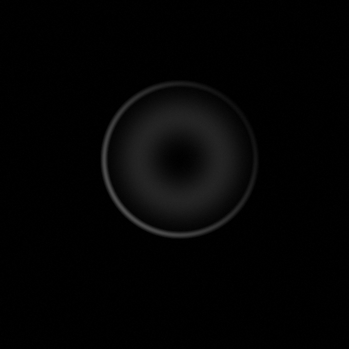
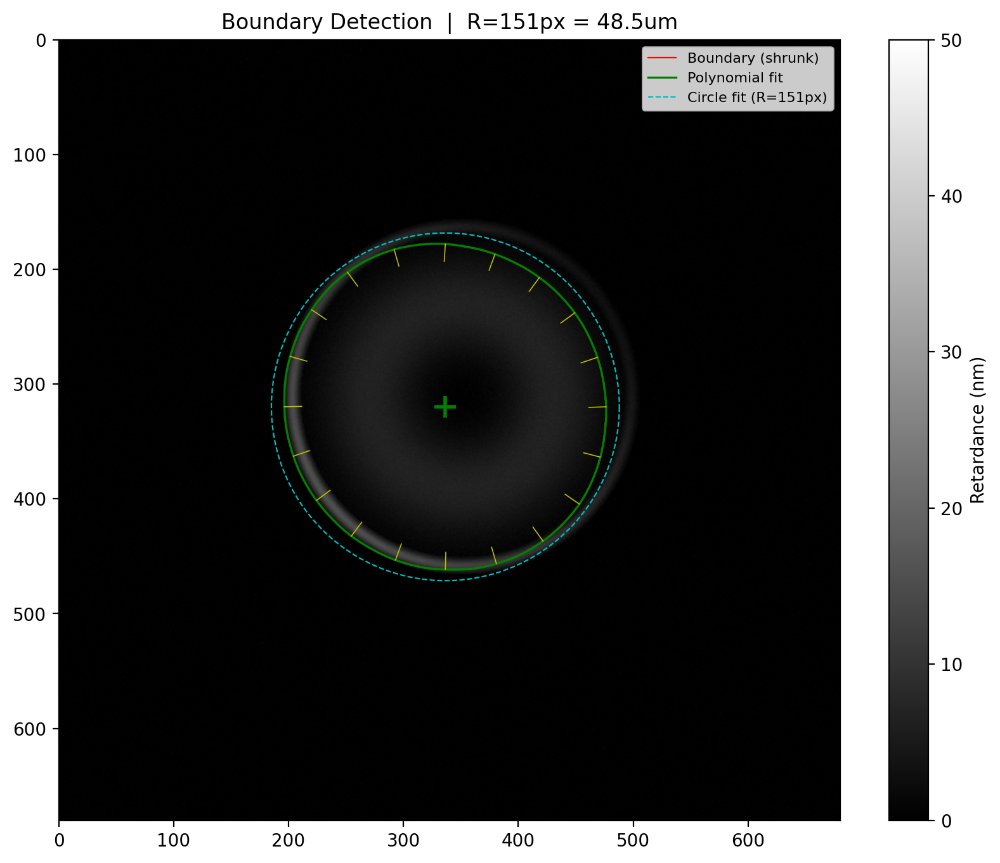
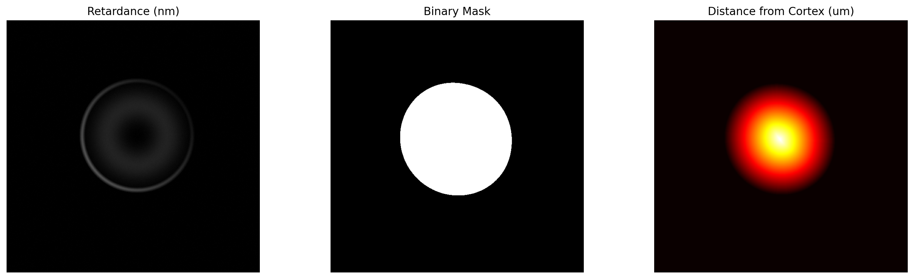
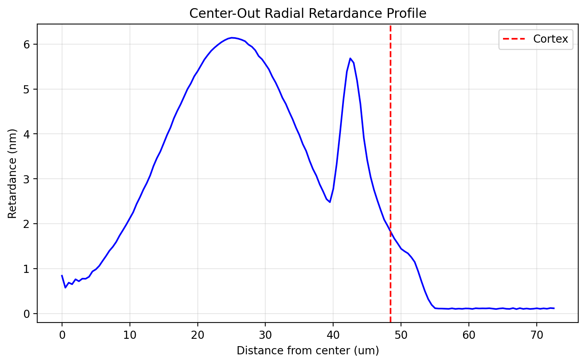
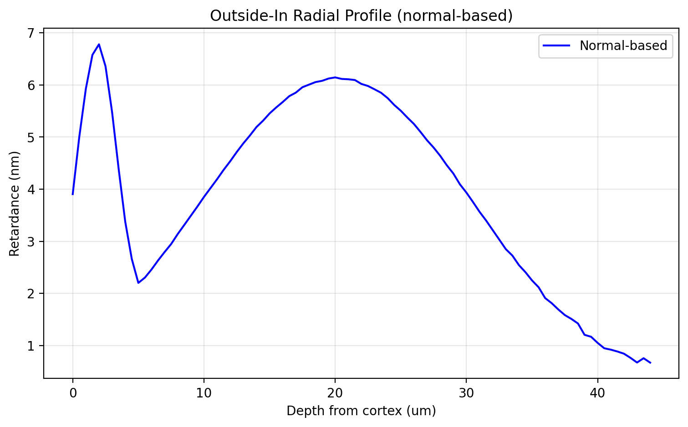
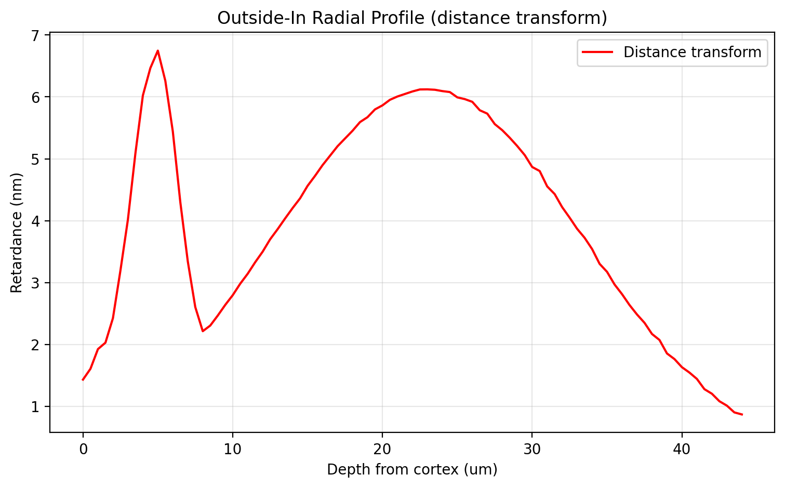
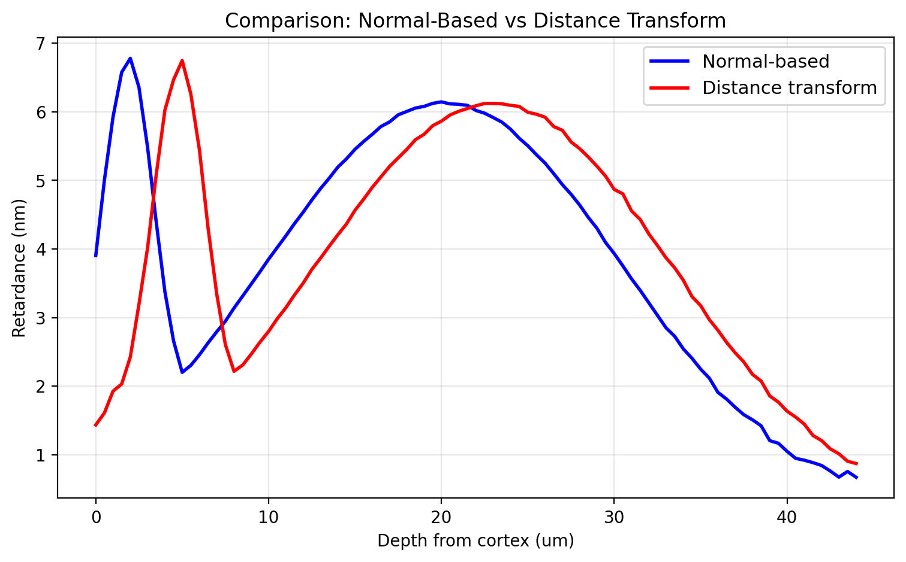
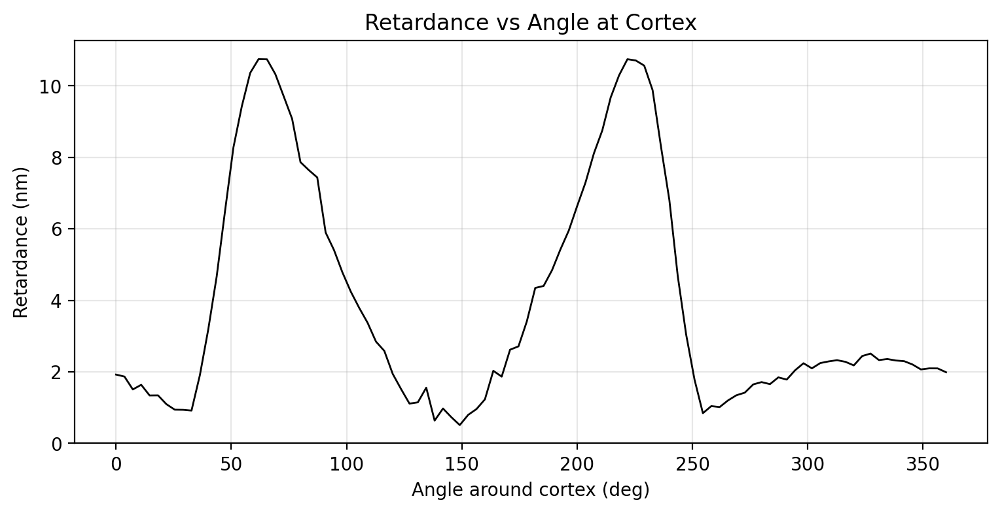

# Demo Output — Single-Image Analysis

Results from `run_single_image.py` on a synthetic oocyte test image.

## Input Image

## 1. Boundary Detection Overlay

Red = shrunk boundary | Green = Fourier-fit | Yellow = inward normals | Cyan = circle fit

## 2. Mask & Distance Transform

Left: retardance | Center: binary mask | Right: distance from cortex

## 3. Center-Out Radial Profile

## 4. Outside-In: Normal-Based

## 5. Outside-In: Distance Transform

## 6. Comparison: Normal vs Distance Transform

## 7. Retardance vs Angle at Cortex

## Summary

| Metric | Value |
|--------|-------|
| Oocyte radius | 151 px = 24.2 um |
| Contour retardance (mean) | 3.97 +/- 3.26 nm |
| Contour retardance (range) | 0.00 - 11.61 nm |
| Fourier harmonics | 25 |
